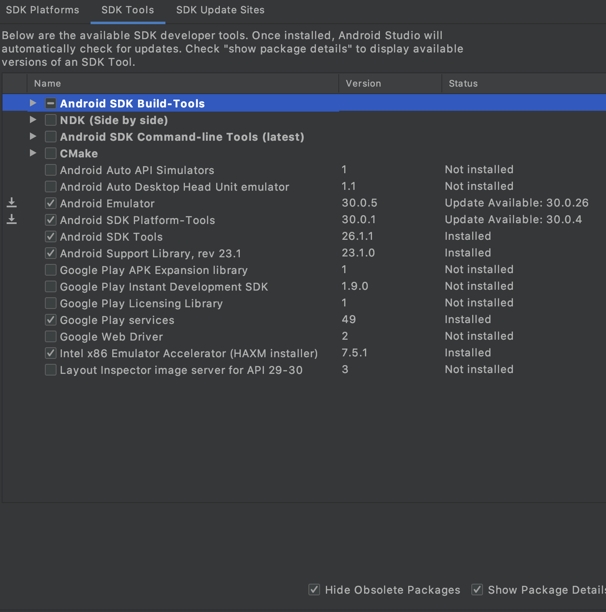
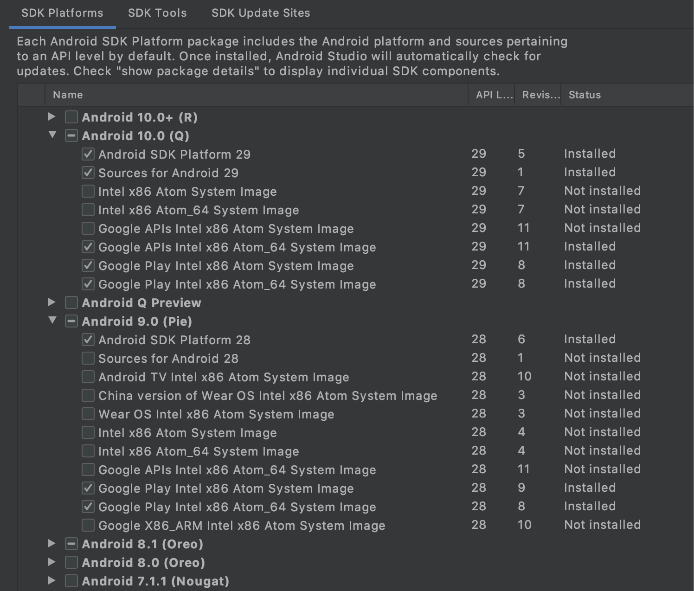

The following instructions apply to the mobile apps for iOS and Android built in React Native.
Download the iOS version [here](https://apps.apple.com/us/app/mattermost/id1257222717) and the Android version [here](https://play.google.com/store/apps/details?id=com.mattermost.rn).
Source code can be found at the [GitHub Mattermost Mobile app repository](https://github.com/mattermost/mattermost-mobile).

If you run into any issues getting your environment set up, check the [Troubleshooting](https://docs.mattermost.com/deploy/mobile-troubleshoot.html) section of the product docs for common solutions.


<Note title="iOS mobile app">
A macOS computer is required to build the Mattermost iOS mobile app.
</Note>


<Note title="Android mobile app">
Version 17 of the Java SE Development Kit (JDK) is required to develop the Mattermost Android mobile app. You can download the latest OpenJDK release of Java from Oracle, for free, under an open source license.
</Note>


## Environment setup

The following instructions apply to both iOS and Android mobile apps.
On macOS, we recommend using [Homebrew](https://brew.sh) as a package manager.

### Install NodeJS and NPM

We recommend using NodeJS v22 and npm v10. Many of our team use [nvm](https://github.com/nvm-sh/nvm) to manage npm and NodeJS versions.

<Tabs>
<TabItem value="node-npm-mac" label="macOS">
To install [NVM](https://github.com/nvm-sh/nvm), follow [these instructions](https://github.com/nvm-sh/nvm#installing-and-updating).

After installing, follow the post-install steps shown by the installer to add the necessary lines to your shell profile (for example `~/.zshrc` or `~/.bash_profile`). Then open a new terminal and run:

```sh
nvm install --lts
```
</TabItem>

<TabItem value="node-npm-linux" label="Linux">
There are three available options for installing NodeJS on Linux:

- Using NVM by following the instructions [here](https://github.com/nvm-sh/nvm#install-script).
- Install using your distribution's package manager.
- Download and install the package from the [NodeJS website](https://nodejs.org/en).

<Note>
The version of NodeJS that your distribution's package manager supports may not be the recommended version to build Mattermost mobile apps.
Please make sure that NodeJS installed by the package manager is at the recommended version.
</Note>
</TabItem>
</Tabs>

### Install Watchman

[Watchman](https://facebook.github.io/watchman) is a file watching program.
When a file changes, Watchman triggers an action, such as re-running a build command if a source file has changed.

The minimum required version of Watchman is 4.9.0.

<Tabs>
<TabItem value="watchman-mac" label="macOS">
To install Watchman using Homebrew, open a terminal and execute:

```sh
brew install watchman
```
</TabItem>

<TabItem value="watchman-linux" label="Linux">
Download the latest package from [here](https://github.com/facebook/watchman/releases).

<Note title="Inotify limits">
Note that you need to increase your `inotify` limits for Watchman to work properly.
</Note>
</TabItem>
</Tabs>

### Install `react-native-cli` tools

```sh
npm -g install react-native-cli
```

### Install Git

<Tabs>
<TabItem value="git-mac" label="macOS">
To install Git using Homebrew, open a terminal and execute:

```sh
brew install git
```
</TabItem>

<TabItem value="git-linux" label="Linux">
Some distributions come with Git preinstalled but you'll most likely have to install it yourself. For most distributions the package is simply called `git`.
</TabItem>
</Tabs>

## Additional setup for iOS (macOS)

### Install XCode

Install [Xcode](https://apps.apple.com/us/app/xcode/id497799835?ls=1&mt=12) to build and run the app on iOS. The minimum required version is 11.0.

### Install Ruby

A version of Ruby is automatically installed on macOS, but Mattermost React Native app development requires Ruby 3.2.0. You can check the current version of Ruby by running the following command.
```sh
ruby --version
```

If it isn't, we recommend using [Ruby Version Manager](https://rvm.io) or your preferred package manager to install the required version. The steps below are for using RVM.

1. Install the GPG keys for RVM using the command found [here](https://rvm.io/rvm/install#install-gpg-keys).
    1. If you don't have the `gpg` command, you can install it using Homebrew by running.
        ```sh
        brew install gnupg
        ```
2. Install the stable version of RVM using the following command.
    ```sh
    \curl -sSL https://get.rvm.io | bash -s stable --ruby
    ```
3. To load RVM, either open a new terminal or run the following command.
    ```sh
    source ~/.rvm/scripts/rvm
    ```
4. Install the required version of Ruby
    ```sh
    rvm install 3.2.0
    ```
5. (Optional) If you don't need to use a different version of Ruby for anything else, you'll want to change the default version of Ruby. Without this, you'll need to run `rvm use 3.2.0` any time you want to work on the mobile app.
    ```sh
    rvm alias create default 3.2.0
    ```

## Additional setup for Android

### Download and install Android Studio or Android SDK CLI tools

Download and install the [Android Studio app or the Android SDK command line tools](https://developer.android.com/studio/index.html#downloads)


<Note title="Default paths">
This documentation assumes you chose the default path for your Android SDK installation. If you chose a different path, adjust the environment variables below accordingly.
</Note>


#### Environment variables

Make sure you have the following environment variables configured for your platform:

<Tabs>
<TabItem value="droid-common" label="All platforms">
- Set `ANDROID_HOME` to where Android SDK is located (likely `/Users/<username>/Library/Android/sdk` or `/home/<username>/Android/Sdk`)
- Make sure your `PATH` includes `ANDROID_HOME/tools` and `ANDROID_HOME/platform-tools`
</TabItem>

<TabItem value="droid-mac" label="macOS">
On Mac, this usually requires adding the following lines to your `~/.bash_profile` file:

```sh
export ANDROID_HOME=$HOME/Library/Android/sdk
export PATH=$ANDROID_HOME/emulator:$ANDROID_HOME/platform-tools:$ANDROID_HOME/tools:$PATH
```

Then reload your bash configuration:

```sh
source ~/.bash_profile
```


<Note>
Depending on the shell you're using, this might need to be put into a different file such as `~/.zshrc`. Adjust this accordingly.
</Note>
</TabItem>

<TabItem value="droid-linux" label="Linux">
On Linux the home folder is located under `/home/<username>` which results in a slightly different path:

```sh
export ANDROID_HOME=/home/<username>/Android/Sdk
export PATH=$ANDROID_HOME/platform-tools:$PATH
export PATH=$ANDROID_HOME/tools:$PATH
```

Then reload your configuration

```sh
source ~/.bash_profile
```


<Note>
Depending on the shell you're using, this might need to be put into a different file such as `~/.zshrc`. Adjust this accordingly.
</Note>
</TabItem>
</Tabs>

### Install the SDKs and SDK tools

In the SDK Manager using Android Studio or the [Android SDK command line tool](https://developer.android.com/studio/command-line/sdkmanager.html), ensure the following are installed:

- SDK Tools (you may have to select **Show Package Details** to expand packages):
  - Android SDK Build-Tools 31
  - Android Emulator
  - Android SDK Platform-Tools
  - Android SDK Tools
  - Google Play services
  - Intel x86 Emulator Accelerator (HAXM installer)
  - Support Repository
    - Android Support Repository
    - Google Repository

  

- SDK Platforms (you may have to select **Show Package Details** to expand packages)
  - Android 12  or above
    - Google APIs
    - SDK Platform
      - Android SDK Platform 31 or above
    - Intel or Google Play Intel x86 Atom\_64 System Image
  - Any other API version that you want to test

  

## Obtain the source code

In order to develop and build the Mattermost mobile apps, you'll need to get a copy of the source code. Forking the `mattermost-mobile` repository will also make it easy to contribute your work back to the project in the future.

1. Fork the [mattermost-mobile](https://github.com/mattermost/mattermost-mobile) repository on GitHub.

2. Clone your fork locally:

   a. Open a terminal

   b. Change to a directory you want to hold your local copy

   c. Run `git clone https://github.com/<username>/mattermost-mobile.git` if you want to use HTTPS, or `git clone git@github.com:<username>/mattermost-mobile.git` if you want to use SSH

     
<Note>
`<username>` refers to the username or organization in GitHub that forked the repository
</Note>


3. Change the directory to `mattermost-mobile`.

   ```sh
   cd mattermost-mobile
   ```

4. Install the project dependencies with `npm install`
